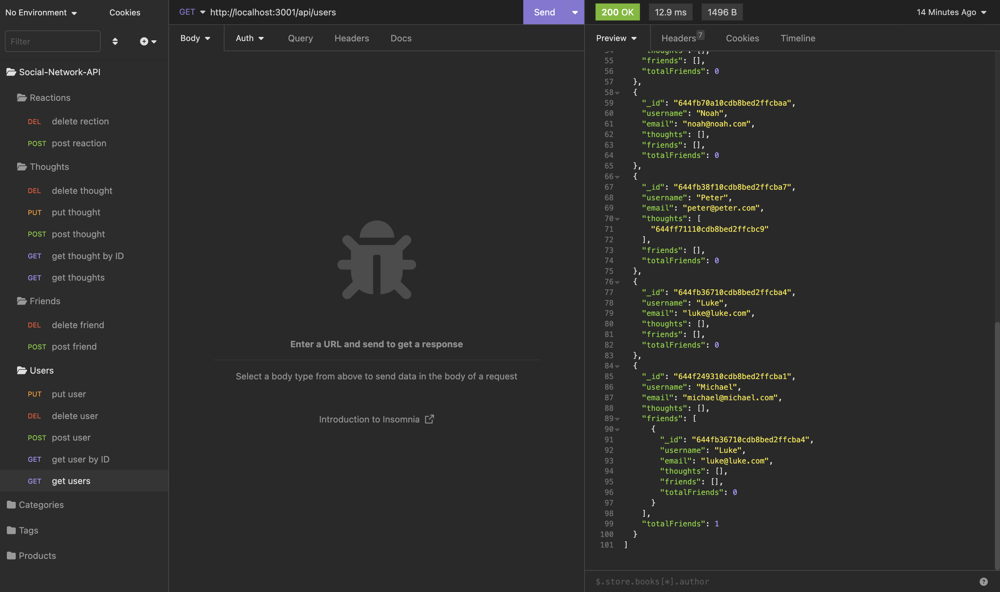

# social_network_backend

## Description

This project provides the backend for a fictional communication network. In which users could create accounts, share their thoughts and comment on each others ideas.

## Table of Contents

- [Installation](#installation)
- [Usage](#usage)
- [License](#license)
- [Questions](#questions)

## Installation

If you would like to run this API, you need to do so locally “git clone” the repo and run an “npm i” in the project folder. Make sure you are in the correct folder! When the dependencies are installed run the “npm start” command in the same project terminal. Use Insomnia or Postman or any other API client to run the requests.

Make sure you have the following technologies installed. Without these the API will not work:

- Node.js
- Express.js
- MongoDB
- Moment.js
- Mongoose

## Usage

Follow my tutorial video or read the code to understand the different routes.
All routes begin with: “http://localhost:3001/api/<fill>”, in the “<fill>” add the route that you would like to call. If you would like to see all users then “http://localhost:3001/api/users”, if you would like to see the thoughts posted by all users then “http://localhost:3001/api/thoughts/”, if you would like to see the thought of a particular user add the particular users id “http://localhost:3001/api/thoughts/644ff71110cdb8bed2ffcbc9”.

## License

This project is covered under the MIT license.

## Questions

If you have any questions, feel free to contact me at jeevanjones.jmkj@gmail.com.
You can also find me on GitHub at [JeevanMKJ](https://github.com/JeevanMKJ).
